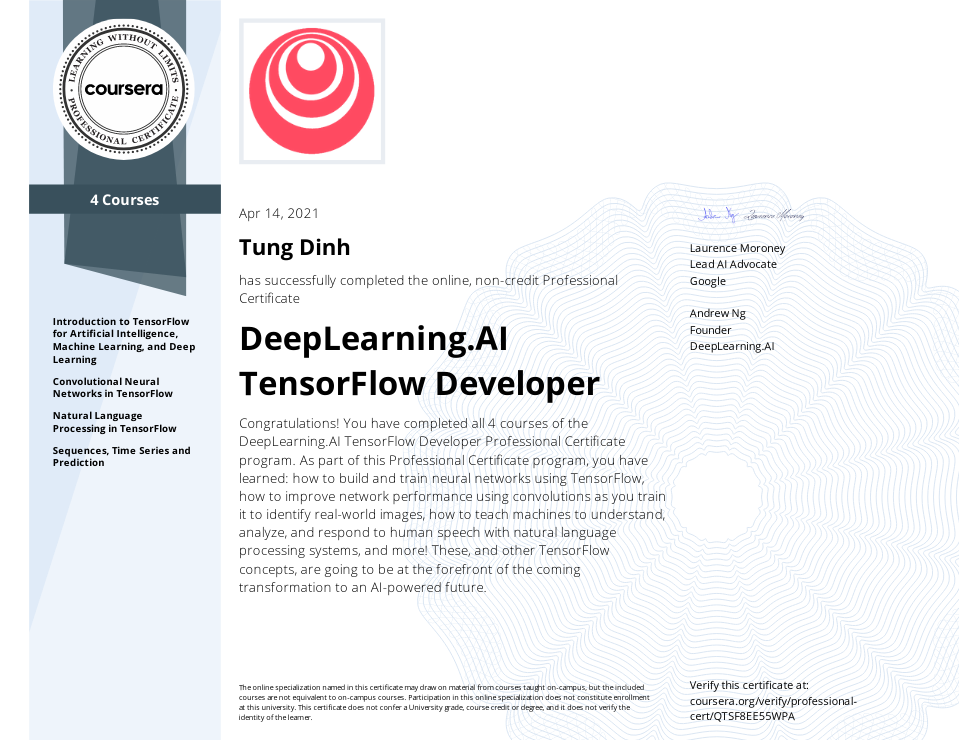

Hi, welcome to my repo about hand-on Tensorflow. 

# Phase 2: Convolutional Neural Network
This second course teaches you advanced techniques to improve the computer vision model you built in Course 1. You will explore how to work with real-world images in different shapes and sizes, visualize the journey of an image through convolutions to understand how a computer “sees” information, plot loss and accuracy, and explore strategies to prevent overfitting, including augmentation and dropouts. Finally, Course 2 will introduce you to transfer learning and how learned features can be extracted from models.

## Classification cats and dogs

## Improve the catdogclassifier

## VGG Net

## Multiclass classification: 

# Phase 3: Natural Language Processing NLP
In this third course, you’ll learn how to apply neural networks to solve natural language processing problems using TensorFlow. You’ll learn how to process and represent text through tokenization so that it’s recognizable by a neural network. You’ll be introduced to new types of neural networks, including RNNs, GRUs and LSTMs, and how you can train them to understand the meaning of text. Finally, you’ll learn how to train LSTMs on existing text to create original poetry and more!
## Sentiment classification

## Embedding
### Topic classification
### Reviews classification: [word](NLP/IMDB_word.ipynb) vs [subword](NLP/IMDB_subword.ipynb)
Word model outputs higher accuracy than subword, however, it requires longer time in training and higher capacity in storage.
Advantage of subword: 
+ Avoid out-of-vocabulary problem.
+ Manageable vocabulary size
+ Mitigate data sparsity: in word data, some words appers only a few times.

## Sequence

## Poeam generation

# Phase4: Time series
In this fourth course, you will learn how to solve time series and forecasting problems in TensorFlow. You’ll first implement best practices to prepare data for time series learning. You’ll also explore how RNNs and ConvNets can be used for predictions. Finally, you’ll apply everything you’ve learned throughout the Specialization to build a sunspot prediction model using real-world data!

## Predict synthetic data

## DNN for time series

## RNN for time series

## Sunspot prediction

Below is the [certificate](https://coursera.org/share/0988be9ea8263100d00b56645c47f2c3).

